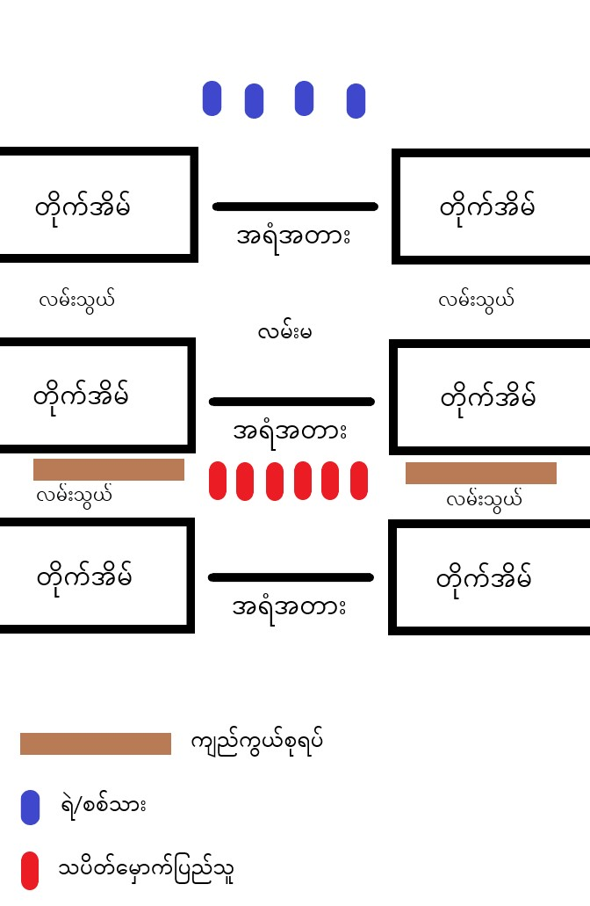

# ပြန်ခုခံကြမယ်

ခုတလောပြန်ခုခံကြမယ်ဆိုတဲ့သတင်းတွေကြားလို့ သပိတ်မှာခံစစ်နဲ့ပတ်သက်ပြီး ကျနော်စဥ်းစားထားသလောက်‌ဝေမျှချင်ပါတယ်။

- ပထမဆုံးကိုယ်လိုက်တဲ့သပိတ်က ခံစစ်ကစားမဲ့ သပိတ်လား ပြေးမဲ့သပိတ်လားအရင်စုံစမ်းပါ။
  သပိတ်ခေါင်းဆောင်တွေကလည်း အမှန်အတိုင်းပြောပြပေးပါ။ သိက္ခာကျမှစိုးလို့ ခံစစ်သပိတ်ပြောပြီး ဟိုကပစ်မှ တကွဲတပြားပြေးရင်ကိုယ့်လူတွေပဲဒုက္ခရောက်မှာပါ။
  ပြေးမဲ့သပိတ်ဆိုရင်တော့ ရဲ/စစ်သား လာပြီလို့သတင်းကြားတာနဲ့လူစုခွဲပြီးကိုယ်ရောင်ဖြောက်ပါ။ သူတို့မတွေ့ခင်ဖြောက်တာပိုစိတ်ချရမယ်လို့ထင်ပါတယ်။

- ခံစစ်ကစားမယ်ဆိုရင်တော့ သပိတ်ပါဝင်တဲ့လူတိုင်း တုတ်တစ်ယောက်တစ်ချောင်းပါကိုပါရပါမယ်။ molotov cockail လိုပါမယ်။ smoke ဗုံးလိုပါမယ်။

- အရံအတားက လူကျော်လို့မရရင်ပိုကောင်းပါတယ်။ လူကျော်လို့မရတဲ့တံတိုင်းဆို အရံအတားထိပ်နှစ်ဖက်ကို လူတစ်‌ယောက်(သို့)နှစ်ယောက်စာဖွင့်ထားပါ။

- လမ်းသွယ်ထိပ်တိုင်းမှာ ကင်းထောက်အနည်းဆုံးနှစ်ယောက်ဆီ ၅မိနစ်(သို့) ၁၀ မိနစ်အလှည့်ကျစောင့်ရပါမယ်။ ရဲ/စစ်သားတစ်ခြားတစ်ဖက်က ဝင်လာမလာကြည့်ပြီးဝင်လာရင် def ပုံစံပြောင်းသင့်ရင်ပြောင်း ဆုတ်သင့်ရင်ဆုတ်ပါ။

- ကိုယ့်လူကိုတစ်ယောက်မှအပါမခံပါနဲ့ မရရအောင်ကိုယ့်လူကိုပြန်ဆွဲပါ၊ သိုးအုပ်နဲ့မြေခွေး ဥပမာကိုသတိရပါ ဒီနေ့ကိုယ့်ကိုဆွဲတာမဟုတ်ဘူးဆိုပြီး ကိုယ့်လူကိုပြန်မဆွဲပဲနေရင် နောက်နေ့ကိုယ့်ကိုဆွဲတဲ့အချိန် ပြန်ဆွဲပေးမဲ့လူရှိမှာမဟုတ်ဘူးဆိုတာသတိရပါ။

## ဟိုဖက်က စပစ်ပြီဆိုရင်

1. ဟိုဖက်က စပစ်ပြီဆိုရင် ဒိုင်းရှိတယ်ဆိုပြီးပေတေခံမနေပါနဲ့ခင်ဗျားတို့ကိုင်ထားတဲ့ဒိုင်းက pistol ကျည်တောင်မကာပါဘူး။ တိုက်တွေကကျည်ကွယ်ပါတယ်။ ပုံထဲမှာပါတဲ့ လမ်းသွယ်ဖက် ကျည်ကွယ်စုရပ်နေရာကိုပြေးပြီး ဟိုဖက်ကတက်လာတာကို စောင့်နေပါ။ သူတို့ကလမ်းမထိပ်ကပစ်တာမို့ ကျည်လမ်းကြောင်းက လမ်းမပေါ် မှာပဲရှိမှာပါ၊ လမ်းသွယ်ထဲ ကျည်လွတ်ပါတယ်။

2. ဟိုဖက်ကတက်လာတဲ့ကောင်တွေအရံအတားနဲ့ ကျည်ကွယ်စုရပ်ကိုကျွံလာပြီတာနဲ့လူစုထဲဆွဲပြီးဝိုင်းရိုက်ပါ။ ရိုက်တဲ့အချိန် ကိုယ့်ဖက်က လမ်မပေါ်ကျွံမသွားအောင်သတိထားပါ။

3. ကျွံလာတဲ့လူမှာသေနတ်ပါရင်နှစ်ယောက်ကသေနတ်ကိုလုပါကျန်တဲ့သူကဝိုင်းရိုက်ပါ။ သေနတ်လုတဲ့အချိန် သေနတ်ပြောင်းထိပ်ကို မိုပေါ်ထောင်နေတဲ့အနေအထားဖြစ်အောင်မြှောက်ထားပြီးလုပါ ခလုတ်ညှစ်လို့ ကျည်ထွက်ရင်တောင် မိုးပေါ်ထောင်ပစ်သလိုဖြစ်အောင်ပါ။ ပြောင်းထိပ်ကို မြေမစိုက်စေပါနဲ့ ကျည်ပြန်ကန်ပြီးလူကိုထိနိုင်ပါတယ်။

4. အရံအတားဟာ သဲအိတ်(ကျည်ကွယ်) ဆိုရင် ပုံထဲက ကျည်ကွယ်စုရပ်အပြင် သဲအိတ်အနောက်မှာလည်းနေလို့ရပါတယ် risk တော့ပိုများမှာမို့သတိထားပါ။ လူတစ်ရပ်အမြင့်ဆိုရင်တောင် တိုက်ပေါ်က(sniper) ရဲ့ပစ်ကွင်းထဲရောက်နေနိုင်ပါတယ်။

5. ဟိုဖက်ကတက်လာမလာ ခေါင်းထွက်မကြည့်ပါနဲ့ ဖုန်းကင်မရာ (သို့) မှန် နဲ့ကြည့်ပါ။

6. ရဲ/စစ်သား အလုံးအရင်းနဲ့ဝင်လာလို့မရအောင် molotov cocktail ကို သူတို့တက်လာမယ့်လမ်းပေါ်ပစ်ထားပါ။

## အိမ်ထဲပြေးပုန်းရပြီဆိုရင်

- အိမ်ထဲပုန်းနေတဲ့အချိန် phone တွေကို silent လုပ်ထားပါ။

- သပိတ်စကတည်းက telegram group ဖြစ်ဖြစ်ဖွဲ့ပြီး သပိတ်မှာပါဝင်တဲ့သူတွေကို gp ထဲထည့်ထားပါ။ gp ထဲမှာ ရဲ/စစ်သားတွေရဲ့အခြေအနေကိုပဲ ပြောပါ၊ ပုန်းနေတဲ့ အချိန်ဘယ်သူကဘယ်မှာပုန်းနေတယ်မပြောပါနဲ့၊ ဒလန်ပါနေရင်သတင်းပြန်ပေးနိုင်ပါတယ်။ ရဲ/စစ်သားတွေ ကိုယ်ပုန်းနေတဲ့အိမ်ကို လာဆွဲပြီဆိုမှ ကိုယ့်နေရာကိုပြောပြီးအကူအညီတောင်းချင်တောင်းပါ။ သပိတ်ပြီးရင် gp ပြန်ဖျက်ပါ။

- အိမ်ထဲမှာပုန်းတဲ့လူနည်းရင် သပိတ်နဲ့ဆိုင်တဲ့ ပါလာသမျှကိုဖြောက်ပြီး မိသားစုဝင်ပုံစံ blend လုပ်ပြီးနေပါ။

- အိမ်ထဲမှာပုန်းတဲ့လူများရင် ခံစစ်ဆက်လုပ်ပါ။ ၁၅ ယောက် ၂၀ လောက်ဆို ခံစစ်လုပ်လို့အဆင်ပြေပါတယ်။
  ခံစစ်လုပ်မယ်ဆိုရင် အိမ်ရှင်ကို အိမ်နောက်ဖေးဖက်ရှောင်ထားခိုင်းပါ။ အိမ်ထဲကို ရဲ/စစ်သား ဝင်လာတော့မယ်ဆိုတာနဲ့ တံခါးဝနားနံရံကိုကပ်ပြီး တုတ်နဲ့အသင့်စောင့်နေပါ။ တံခါးပွင့်ပြီဆိုတာနဲ့ ဝိုင်းရိုက်ပါ။ သေနတ်ပါလာရင်သေနတ်ကိုလုပါ အနီးကပ်သူ့လူကိုယ့်လူ ရောထွေနေတဲ့အချိန် သေနတ်နတ်နဲ့ပစ်ရင် သူ့လူပါထိနိုင်လို့ သေနတ်ပစ်ဖို့အခွင့်အရေး နည်းပါတယ်။ ရန်ကုန်လို မြို့မျိုးမှာဆို တိုက်တွေရဲ့လှေကားအတက်အဆင်းကနေရာကျဥ်းတာမို့ ရဲ/စစ်သားတွေ အလုံးအရင်းနဲ့ဝင်လာလို့မရပါဘူး ဒါဟာကိုယ့်အတွက်အားသာချက်တစ်ခုပါ။ ရဲ/စစ်သား လူအင်အားအခြေအနေကိုကြည့်ပြီး အကူခေါ်သင့်ရင် ဖွဲ့ထားတဲ့ gp ထဲကနေတစ်ဆင့်ခေါ်ပါ။

P.S. သေတဲ့အထိမလုပ်စေချင်ပါ နောက်ကိုသေနတ်မကိုင်နိုင်အောင်ပဲလုပ်ပါ။ သေနတ်မကိုင်နိုင်တဲ့ စစ်သားဟာ အဆွယ်ကျိုးနေတဲ့မြွေနဲ့တူတူပါပဲ။ သတ်တာမသတ်တာခင်ဗျားတို့အပိုင်းဆိုပေမဲ့ ကျနော်ကတော့ သတ်တာအားမပေးပါဘူး၊ သတ်လည်းမသတ်ရဲပါဘူး။

---

